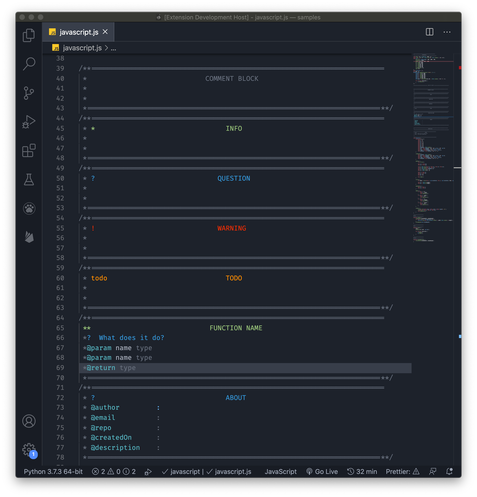
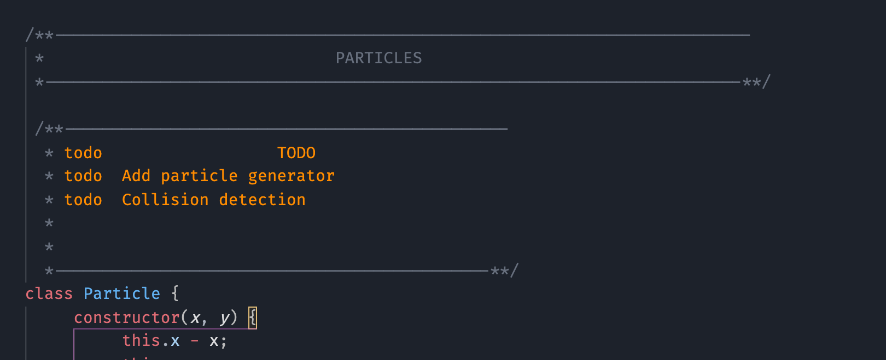
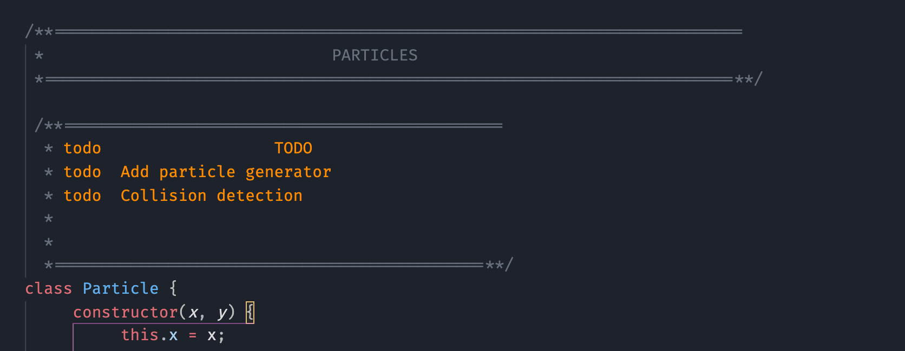

<h1 align="center">
   
  
  
   
   
  COMMENT HEADERS
  

</h1>

<h3 align="center">Comment header snippets for VS-Code</h3>
<h4 align="center"><a href="#related">Supports 30+ languages</a></h4></h4>

  <a href="#how-to-install">How To Install</a> •
  <a href="#how-to-use">How To Use</a> •
  <a href="#related">Supported languages</a> 
  <a href="#how-to-use">How To Use</a> •
  <a href="#related">Supported languages</a> 

 

<b>Write beautifully structured code &#127881;</b>
 

 

## How to Install

 

&#12336;&#12336;&#12336;&#12336;&#12336;&#12336;&#12336;&#12336;&#12336;&#12336;&#12336;&#12336;&#12336;&#12336;&#12336;&#12336;&#12336;&#12336;&#12336;&#12336;&#12336;&#12336;&#12336;&#12336;&#12336;&#12336;&#12336;&#12336;&#12336;&#12336;&#12336;&#12336;&#12336;&#12336;&#12336;&#12336;&#12336;&#12336;&#12336;&#12336;&#12336;&#12336;&#12336;&#12336;&#12336;&#12336;&#12336;&#12336;&#12336;&#12336;&#12336;&#12336;

 

## How to use
 

&#12336;&#12336;&#12336;&#12336;&#12336;&#12336;&#12336;&#12336;&#12336;&#12336;&#12336;&#12336;&#12336;&#12336;&#12336;&#12336;&#12336;&#12336;&#12336;&#12336;&#12336;&#12336;&#12336;&#12336;&#12336;&#12336;&#12336;&#12336;&#12336;&#12336;&#12336;&#12336;&#12336;&#12336;&#12336;&#12336;&#12336;&#12336;&#12336;&#12336;&#12336;&#12336;&#12336;&#12336;&#12336;&#12336;&#12336;&#12336;&#12336;&#12336;&#12336;&#12336;

 

## Comment types

### 1. Block

| Type     | Identifier                   | Example                                 |
| -------- | ---------------------------- | --------------------------------------- |
| Default  | `block`                      | `//block-md`..                          |
| Info     | `info-block` ,`*block`       | `//info-block-md`, `//*block-md`..      |
| Question | `question-block`,`?block`    | `//question-block-md` , `//?block-md`.. |
| Warning  | `warning-block`,`!block`     | `//warning-block-md`, `//!block-md`..   |
| Function | `function-block` , `()block` | `//function-block-md`, `//()block-md`.. |
| Todo     | `todo-block`                 | `//todo-block-md`..                     |
| About    | `about-block`                | `//about-block-md`..                    |

 

### 2. Header

| Type     | Identifier                   | Example                                   |
| -------- | ---------------------------- | ----------------------------------------- |
| Default  | `header`                     | `//header-md`..                           |
| Info     | `info-header` , `*header`    | `//info-header-md`, `//*header-md`..      |
| Question | `question-header`, `?header` | `//question-header-md` , `//?header-md`.. |
| Warning  | `warning-header`, `!header`  | `//warning-header-md`, `//!header-md`..   |
| Todo     | `todo-header`                | `//todo-header-md`..                      |

 

### 3. Footer

| Type    | Identifier | Example                   |
| ------- | ---------- | ------------------------- |
| Default | `end`      | `//end-sm`, `//end-md` .. |

 

### 4. Divider

| Type    | Identifier | Example                           |
| ------- | ---------- | --------------------------------- |
| Default | `divider`  | `//divider-sm`, `//divider-md` .. |

 

### 5. Divider plain

| Type    | Identifier      | Example                                       |
| ------- | --------------- | --------------------------------------------- |
| Default | `divider-plain` | `//divider-plain-sm`, `//divider-plain-md` .. |

 

### 6. Inline

| Type     | Identifier      | Example              |
| -------- | --------------- | -------------------- |
| Default  | `comment`       | `//comment`          |
| Info     | `info` , `*`    | `//info`, `//*`      |
| Question | `question`, `?` | `//question` , `//?` |
| Warning  | `warning`, `!`  | `//warning`, `//!`   |
| Todo     | `todo`          | `//todo`             |

 

### 7. Multiline

| Type    | Identifier  | Example       |
| ------- | ----------- | ------------- |
| Default | `multiline` | `//multiline` |

 

&#12336;&#12336;&#12336;&#12336;&#12336;&#12336;&#12336;&#12336;&#12336;&#12336;&#12336;&#12336;&#12336;&#12336;&#12336;&#12336;&#12336;&#12336;&#12336;&#12336;&#12336;&#12336;&#12336;&#12336;&#12336;&#12336;&#12336;&#12336;&#12336;&#12336;&#12336;&#12336;&#12336;&#12336;&#12336;&#12336;&#12336;&#12336;&#12336;&#12336;&#12336;&#12336;&#12336;&#12336;&#12336;&#12336;&#12336;&#12336;&#12336;&#12336;&#12336;&#12336;

 

## Line Style

| Type         | Idetifier | Example       |
| ------------ | --------- | ------------- |
| Single lined | `/`       | `/header-sm`  |
| Double lined | `//`      | `//header-sm` |

<h4>Single lined</h4>

<h4>Double lined</h4>

 

&#12336;&#12336;&#12336;&#12336;&#12336;&#12336;&#12336;&#12336;&#12336;&#12336;&#12336;&#12336;&#12336;&#12336;&#12336;&#12336;&#12336;&#12336;&#12336;&#12336;&#12336;&#12336;&#12336;&#12336;&#12336;&#12336;&#12336;&#12336;&#12336;&#12336;&#12336;&#12336;&#12336;&#12336;&#12336;&#12336;&#12336;&#12336;&#12336;&#12336;&#12336;&#12336;&#12336;&#12336;&#12336;&#12336;&#12336;&#12336;&#12336;&#12336;&#12336;&#12336;

 

## Sizes

| Type              | Identifier | Example        |
| ----------------- | ---------- | -------------- |
| Small             | `-sm `     | `//header-sm`  |
| Medium            | `-md `     | `//header-md`  |
| Large             | `-lg `     | `//header-lg`  |
| Extra Large       | `-xl `     | `//header-xl`  |
| Extra Extra Large | `-xxl `    | `//header-xxl` |

Note: Inline(7) and Multiline (8) commments do not have size option.

 

&#12336;&#12336;&#12336;&#12336;&#12336;&#12336;&#12336;&#12336;&#12336;&#12336;&#12336;&#12336;&#12336;&#12336;&#12336;&#12336;&#12336;&#12336;&#12336;&#12336;&#12336;&#12336;&#12336;&#12336;&#12336;&#12336;&#12336;&#12336;&#12336;&#12336;&#12336;&#12336;&#12336;&#12336;&#12336;&#12336;&#12336;&#12336;&#12336;&#12336;&#12336;&#12336;&#12336;&#12336;&#12336;&#12336;&#12336;&#12336;&#12336;&#12336;&#12336;&#12336;

 

## Supported Languages

(expand)

-    C
-    C#
-    C++
-    Coffeescript
-    Coldfusion\*
-    CSS
-    Dart
-    Dockerfile
-    Go
-    Groovy
-    HTML\*
-    Java
-    Javascript
-    JOSC
-    LESS
-    Markdown\*
-    Nested
-    Nim
-    Objective-c
-    Objective-cpp
-    Perl
-    Php
-    Powershell
-    Puppet
-    Python
-    R
-    Ruby
-    Rust
-    SASS
-    SCSS
-    Shellscript
-    SQL
-    Stylus
-    Swift
-    TCL
-    Typescript
-    Vue
-    XML\*
-    XSL\*
-    YAML
       \*supports only dividers

 

&#12336;&#12336;&#12336;&#12336;&#12336;&#12336;&#12336;&#12336;&#12336;&#12336;&#12336;&#12336;&#12336;&#12336;&#12336;&#12336;&#12336;&#12336;&#12336;&#12336;&#12336;&#12336;&#12336;&#12336;&#12336;&#12336;&#12336;&#12336;&#12336;&#12336;&#12336;&#12336;&#12336;&#12336;&#12336;&#12336;&#12336;&#12336;&#12336;&#12336;&#12336;&#12336;&#12336;&#12336;&#12336;&#12336;&#12336;&#12336;&#12336;&#12336;&#12336;&#12336;

 

Happy Coding 

