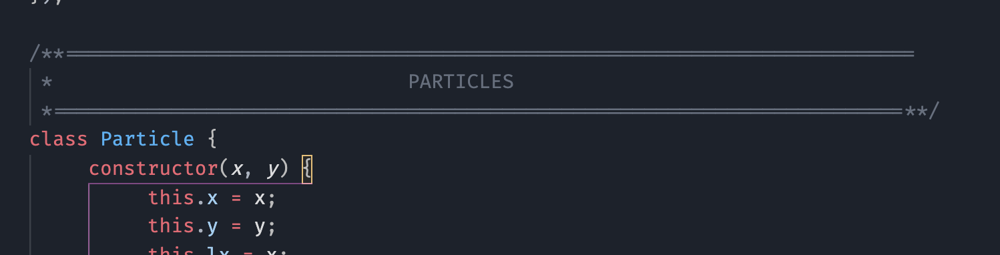
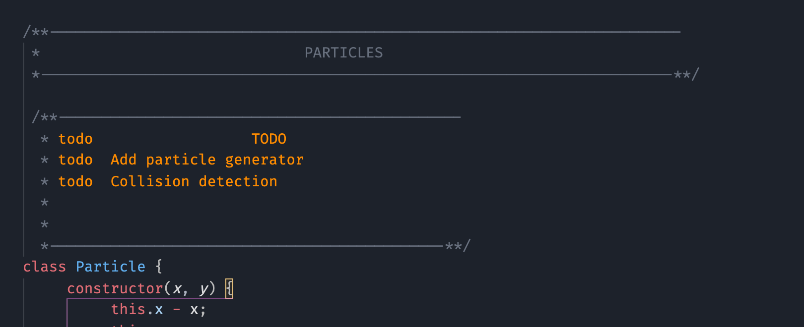
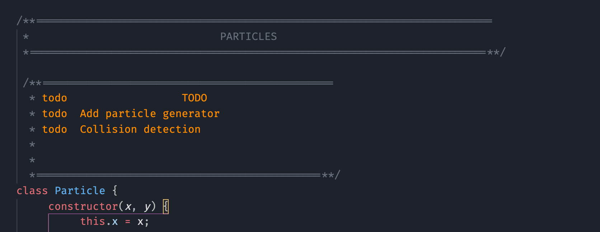

<h1 align="center">
   
  
  
   
   
  COMMENT HEADERS
  

</h1>

<h2 align="center">Comment header snippets for VS-Code</h2>
<h4 align="center"><a href="#related">Supports 30+ languages</a></h4></h4>

 

  <a href="#how-to-use">How To Install</a> •
  <a href="#download">How To Use</a> •
  <a href="#credits">Triggers</a> •
  <a href="#related">Supported languages</a> 

## :triangular_flag_on_post: How to Install

## :triangular_flag_on_post: How to Use

## :triangular_flag_on_post: Comment Type

### 1. Block

| Type     | Idetifier                       | example                                     |
| -------- | ------------------------------- | ------------------------------------------- |
| Default  | `block`                         | `//block-md`..                              |
| Info     | `info-block` ,  `*block`     | `//info-block-md`,  `//*block-md`..      |
| Question | `question-block`,  `?block`  | `//question-block-md` ,  `//?block-md`.. |
| Warning  | `warning-block`,  `!block`   | `//warning-block-md`,  `//!block-md`..   |
| Function | `function-block` ,  `()block` | `//function-block-md`,  `//()block-md`..                        |
| Todo     | `todo-block`                    | `//todo-block-md`..                         |
| About    | `about-block`                   | `//about-block-md`..                         |

 
 

### 2. Header

| Type     | Idetifier                        | example                                       |
| -------- | -------------------------------- | --------------------------------------------- |
| Default  | `header`                         | `//header-md`..                               |
| Info     | `info-header` ,  `*header`    | `//info-header-md`,  `//*header-md`..      |
| Question | `question-header`,  `?header` | `//question-header-md` ,  `//?header-md`.. |
| Warning  | `warning-header`,  `!header`  | `//warning-header-md`,  `//!header-md`..   |
| Todo     | `todo-header`                    | `//todo-header-md`..                          |

 
 

### 3. Footer

| Type    | Idetifier | example                       |
| ------- | --------- | ----------------------------- |
| Default | `end`     | `//end-sm`,  `//end-md` .. |

 
 

### 4. Divider

| Type    | Idetifier | example                               |
| ------- | --------- | ------------------------------------- |
| Default | `divider` | `//divider-sm`,  `//divider-md` .. |

 
 

### 5. Divider plain

| Type    | Idetifier       | example                                           |
| ------- | --------------- | ------------------------------------------------- |
| Default | `divider-plain` | `//divider-plain-sm`,  `//divider-plain-md` .. |

 
 

### 6. Single line

 
 

### 7. Multiline

## :triangular_flag_on_post: Line Style

| Type         | Idetifier | example       |
| ------------ | --------- | ------------- |
| Single lined | `/`       | `/header-sm`  |
| Double lined | `//`      | `//header-sm` |

 
<h4>Single lined</h4>

 

<h4>Double lined</h4>

:wavy_dash::wavy_dash::wavy_dash::wavy_dash::wavy_dash::wavy_dash::wavy_dash::wavy_dash::wavy_dash::wavy_dash:

## :triangular_flag_on_post: Sizes

| Type              | Identifier | Example        |
| ----------------- | ---------- | -------------- |
| Small             | `-sm `     | `//header-sm`  |
| Medium            | `-md `     | `//header-md`  |
| Large             | `-lg `     | `//header-lg`  |
| Extra Large       | `-xl `     | `//header-xl`  |
| Extra Extra Large | `-xxl `    | `//header-xxl` |

 
 

## :triangular_flag_on_post: Supported Languages

(expand)

-    C
-    C#
-    C++
-    Coffeescript
-    Coldfusion\*
-    CSS
-    Dart
-    Dockerfile
-    Go
-    Groovy
-    HTML\*
-    Java
-    Javascript
-    JOSC
-    LESS
-    Markdown\*
-    Nested
-    Nim
-    Objective-c
-    Objective-cpp
-    Perl
-    Php
-    Powershell
-    Puppet
-    Python
-    R
-    Ruby
-    Rust
-    SASS
-    SCSS
-    Shellscript
-    SQL
-    Stylus
-    Swift
-    TCL
-    Typescript
-    Vue
-    XML\*
-    XSL\*
-    YAML
       \*supports only dividers

#

Happy Coding  :trollface:

