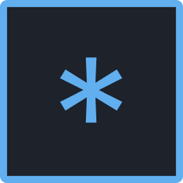

<h1 align="center">
   
  
   
   
  COMMENT HEADERS
   
   
</h1>

<h4 align="center">Comment header snippets for VS-Code</h4>
 

  <a href="#how-to-use">How To Install</a> •
  <a href="#download">How To Use</a> •
  <a href="#credits">Triggers</a> •
  <a href="#related">Supported languages</a> 

## How to Install

## How to Use

## Triggers

## Supported Languages

(expand)

* C
* C#
* C++
* Coffeescript
* Coldfusion (only support dividers)
* Css 
* Dart 
* Dockerfile 
* Go 
* Groovy 
* HTML (only support dividers)
* Java 
* Javascript 
* JOSC 
* LESS 
* Markdown (only support dividers)
* Nested 
* Nim 
* Objective-c 
* Objective-cpp 
* Perl 
* Php 
* Powershell 
* Puppet 
* Python 
* R 
* Ruby 
* Rust 
* SASS 
* SCSS 
* Shellscript 
* SQL 
* Stylus 
* Swift 
* TCL 
* Typescript 
* Vue
* XML (only support dividers)
* XSL (only support dividers)
* YAML
 

#

Happy Coding  :trollface:
